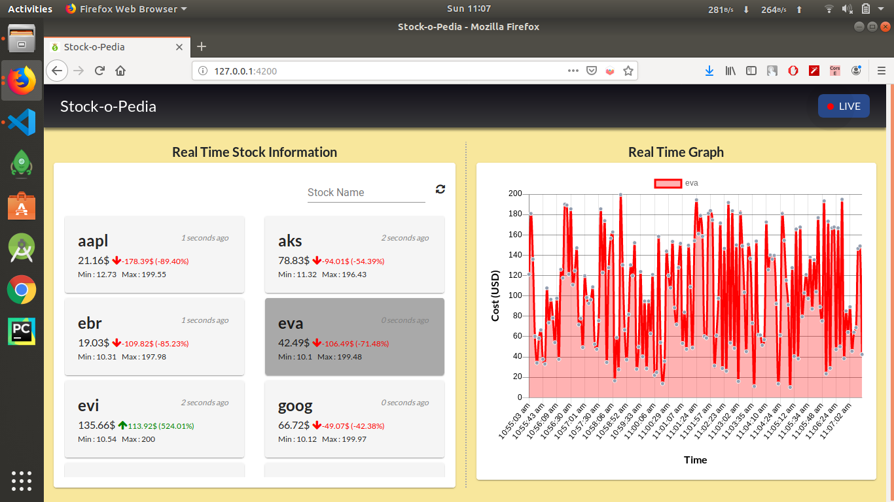

# StocksApp
View this app live at https://stock-o-pedia.herokuapp.com/.
It is a PWA installable(over https) but WebSocket end point is unsecure so might need to allow 'load unsecure scripts' when prompte d or use http instead.
## Running Application
Simply do an `npm install`, your project will be setup post install. Then to run, do `npm start` to run the application.

## Features
1. Live Stock information 
2. View Live graph as changes are pushed onto the chart
2. Reconnect to network feature, automatic + manual, if failed
3. Service Worker for offline project structure support
4. PWA Installable(for supported browser versions eg Chrome 70+) (https only)
6. Technically, minified code using Terser + treeshaked ES2015 module
7. Deployment automation on Heroku

## Stack Used
1. Angular 8
2. RxJs
3. chart.js
4. Plain HTML5/SCSS
5. Webpack
6. Workbox Webpack Plugin for Service Worker Generation

## Improvement Scope
1. Stack multiple stock into a single chart
2. Offline caching of pre-existing stock data for offline view via IndexedDB
3. Performance: 
    1. Serve gzipped or brotli compressed files over the network
    2. Chunk Js files categorically and multiplex requests over to the browser [H2]
 
## Sample

